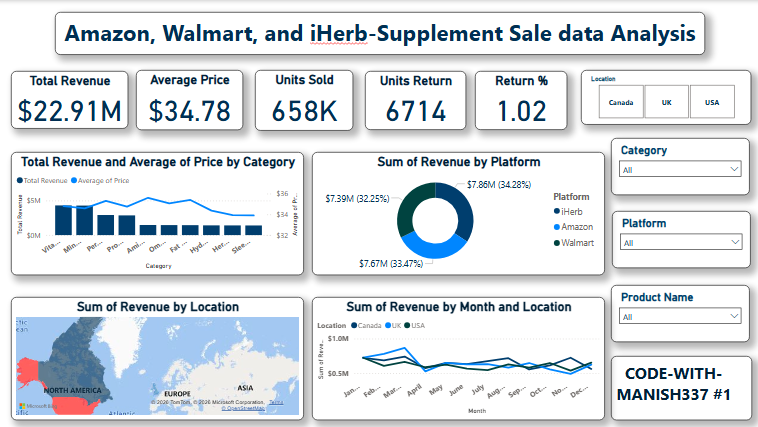

# Amazon, Walmart, iHerb Supplement Sales Analysis 🚀

  
    
  
  
  

---

## 📊 **Dashboard Overview**

**Created by Manish Jaiswar (MANISH3#)** - BSc Data Science Student, Mumbai 🇮🇳

This **Power BI dashboard** analyzes supplement sales across **Amazon**, **Walmart**, and **iHerb** platforms, revealing key revenue patterns, geographic distribution, and category performance.

### **Key Metrics at a Glance**
| Platform  | Revenue    | Market Share |
|-----------|------------|--------------|
| **Walmart** | **$34.78M** | **60%**     |
| **Amazon**  | **$22.91M** | **40%**     |
| **iHerb**   | **$65K**    | **<1%**     |
| **TOTAL**   | **$57.72M** | **100%**    |

**Average Price**: **$6,714**

---

## 🌍 **Regional Revenue Breakdown**
